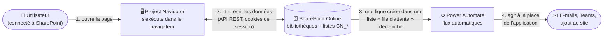
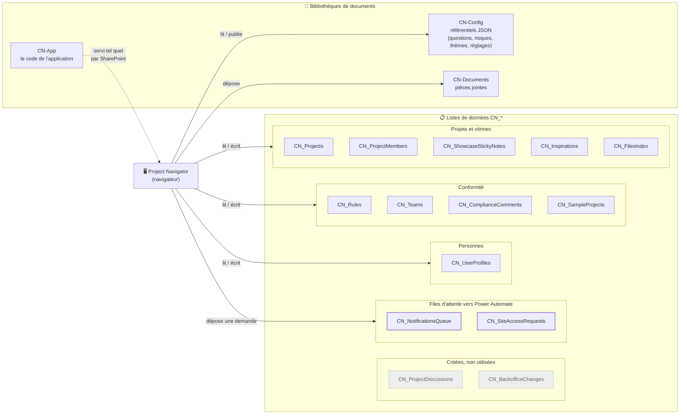
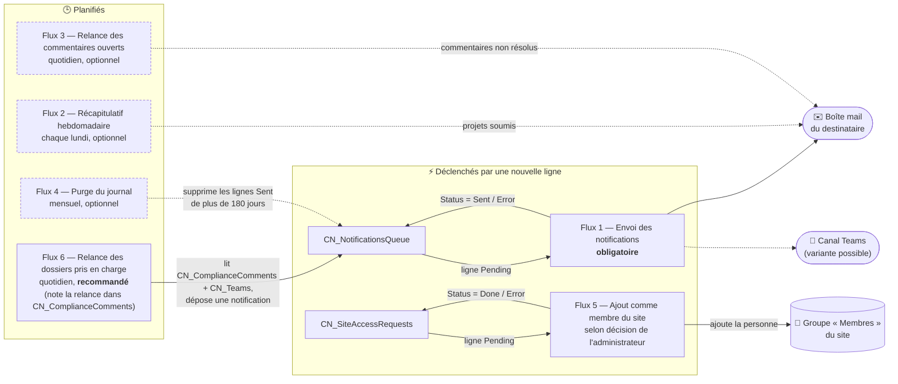

# Architecture SharePoint

> Public : développeurs **et** non-experts. Ce document explique où vivent les données de
> Project Navigator et comment elles circulent entre l'application, SharePoint Online et
> Power Automate. Il complète [`architecture-technique.md`](architecture-technique.md) /
> [`architecture-technique-non-expert.md`](architecture-technique-non-expert.md) (comment le code
> est fait) et [`securite-donnees.md`](securite-donnees.md) /
> [`securite-donnees-non-expert.md`](securite-donnees-non-expert.md) (ce que cette architecture
> garantit en matière de sécurité).
>
> Détail opérationnel complet (colonnes exactes, étapes de configuration, mode opératoire
> Power Automate pas à pas) : dossier [`migration-v2/`](migration-v2/README.md).

## Vue d'ensemble

Project Navigator est un ensemble de fichiers statiques (HTML/JS/CSS, sans serveur applicatif)
déposé dans une bibliothèque du site SharePoint de l'organisation. Le navigateur de la personne
connectée envoie ses requêtes directement à l'API REST native de SharePoint
(`/_api/…`), authentifiées par les cookies de sa session SharePoint — il n'y a ni serveur
intermédiaire, ni jeton applicatif, ni compte de service. Tout ce que l'application ne peut pas
faire elle-même avec ces droits (envoyer un e-mail, ajouter quelqu'un comme membre du site) est
délégué à des flux Power Automate déclenchés par la création d'une ligne dans une liste dédiée.

Un second mode, **local/simulé**, reproduit cette même architecture avec des fichiers JSON et le
stockage du navigateur, pour le développement et l'ouverture directe du fichier `index.html`
(`file://`, sans SharePoint) — voir la légende.

## Diagrammes

Le schéma est découpé en trois vues, de la plus simple à la plus détaillée : la première suffit
pour comprendre le principe, les deux suivantes zooment sur les données puis sur les automates.

### 1. Le principe en un coup d'œil

Trois acteurs seulement, et aucun serveur à nous : le navigateur parle directement à SharePoint,
et SharePoint confie à Power Automate tout ce qui sort du site (e-mails, ajout de membres).

### 2. Où vivent les données

Les listes sont regroupées par usage. L'application lit et écrit dans toutes, sauf les deux
listes grisées, créées mais jamais utilisées à ce jour. Les deux listes « files d'attente » sont
le seul point de contact avec Power Automate : l'application y dépose une demande, un flux la
traite.

### 3. Les automates Power Automate

Deux familles de flux. Les flux **événementiels** partent dès qu'une ligne « Pending » apparaît
dans une file d'attente, puis y inscrivent le résultat. Les flux **planifiés** tournent à heure
fixe, lisent les listes et, au besoin, déposent eux-mêmes une notification dans la file.
Trait plein : obligatoire ou recommandé ; pointillés : optionnel.

## Légende

**Utilisateur → Application.** La page est servie par SharePoint lui-même
(`https://<tenant>.sharepoint.com/sites/<site>/CN-App/index.aspx`) : le navigateur envoie
automatiquement les cookies de session SPO. Il n'y a ni écran de connexion applicatif, ni jeton
géré par le code (`src/utils/spContext.js`, `src/config/sharepointConfig.js`).

**Bibliothèques de documents**
| Bibliothèque | Contenu |
|---|---|
| `CN-App` | Le code de l'application elle-même (HTML/JS/CSS statiques). |
| `CN-Config` | Les référentiels administrables du back-office, sous forme de fichiers JSON (`questions.json`, `risk-level-rules.json`, `risk-weighting.json`, `showcase-themes.json`, `settings.json`). |
| `CN-Documents` | Les pièces jointes déposées par les utilisateurs (annotations, commentaires de conformité), rangées par entité (`{EntityType}/{EntityId}`). |

**Listes de données (`CN_*`)** — 14 listes, décrites colonne par colonne dans
[`migration-v2/PREPARATION-SHAREPOINT-POWERAUTOMATE.md`](migration-v2/PREPARATION-SHAREPOINT-POWERAUTOMATE.md)
et vérifiables via le script de
[`migration-v2/VERIFICATION-CONFIGURATION-SHAREPOINT.md`](migration-v2/VERIFICATION-CONFIGURATION-SHAREPOINT.md).
Deux d'entre elles (grisées sur le diagramme 2), `CN_ProjectDiscussions` et
`CN_BackofficeChanges`, ont leur schéma de colonnes déclaré et la liste créée côté SharePoint,
mais **aucune fonctionnalité de l'application ne les lit ou n'y écrit à ce jour** — décision
documentée dans `src/utils/listSchemas.js`. Les données volumineuses ou imbriquées (réponses au
questionnaire, règle de conformité entière, etc.) voyagent en colonnes « texte long » contenant du
JSON sérialisé (`AnswersJson`, `PayloadJson`, `AnchorJson`…), pas en colonnes structurées — c'est
la seule vraie divergence entre le mode SharePoint et le mode local/simulé.

**Power Automate** — l'application **n'envoie jamais d'e-mail ni de message Teams elle-même** :
c'est une contrainte du tenant (l'API Microsoft Graph `sendMail` est interdite par la politique de
sécurité, et l'ancienne API SharePoint `SP.Utilities.Utility.SendEmail` a été retirée par
Microsoft). Chaque flux est déclenché par la création d'une ligne dans une liste :

| Flux | Déclencheur | Nécessité |
|---|---|---|
| 1 — Envoi des notifications | Création dans `CN_NotificationsQueue` | **Obligatoire** — sans lui, aucun e-mail ne part. |
| 5 — Ajout comme membre du site | Création dans `CN_SiteAccessRequests` | Selon une décision explicite de l'administrateur du site (« par précaution, ajouter automatiquement comme membre »). |
| 6 — Relance des dossiers pris en charge | Périodicité quotidienne, lecture de `CN_ComplianceComments`/`CN_Teams` | Recommandé — en mode SharePoint, l'application ne calcule plus elle-même cette relance (voir `securite-donnees.md` et `migration-v2/MODE-OPERATOIRE-POWER-AUTOMATE.md`). |
| 2 — Récapitulatif hebdomadaire | Périodicité (lundi 08:00) | Optionnel. |
| 3 — Relance des commentaires non résolus | Périodicité quotidienne | Optionnel. |
| 4 — Purge du journal de notifications | Périodicité mensuelle | Optionnel, entretien. |

Mode opératoire complet de chaque flux (déclencheur, actions, expressions, recette de test) :
[`migration-v2/MODE-OPERATOIRE-POWER-AUTOMATE.md`](migration-v2/MODE-OPERATOIRE-POWER-AUTOMATE.md).

**Mode local/simulé (non représenté sur les diagrammes ci-dessus).** Hors origine SharePoint
(ouverture directe de `index.html` en `file://`, développement, tests), l'aiguillage
`isSharePointMode()` (`src/config/sharepointConfig.js`) bascule l'application sur des fournisseurs
de données simulés : fichiers `mock-sharepoint-lists/*.json`/`src/data/mockSharePoint*.js` en
lieu et place des listes, et stockage du navigateur (`localStorage`, clé
`complianceNavigatorState`) en lieu et place de SharePoint. Les notifications qui partiraient vers
`CN_NotificationsQueue` sont alors simplement journalisées dans la console du navigateur
(`console.info`), sans aucun envoi réel.
